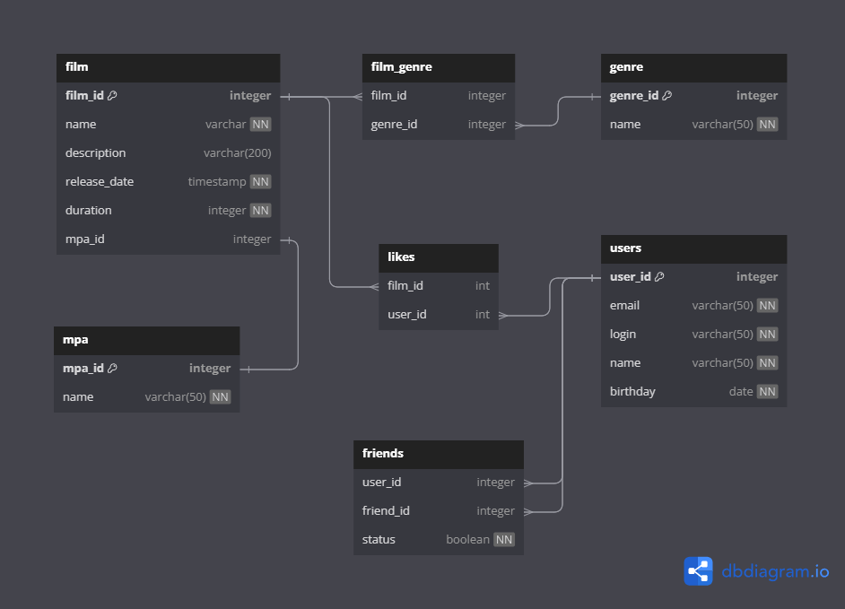

# Java-Filmorate
## Бэкенд приложения для просмотра и подбора фильмов

## Реализованный функционал:
Для работы с пользователями:
* Добавить пользователя
* Обновить пользователя
* Получить всех пользователей
* Получение пользователя по его id
* Добавление пользователя в друзья
* Удаление пользователя из друзей
* Получение списка друзей пользователя
* Получение общих друзей с указанным пользователем

Для работы с фильмами:
* Добавить фильм
* Обновить фильм
* Получить все фильмы
* Получение фильма по его id
* Поставить лайк фильму
* Удалить лайк у фильма
* Получение указанного количества фильмов по убыванию рейтинга
* Получение списка жанров 
* Получение списка возрастных рейтингов

## ER - диаграмма приложения

